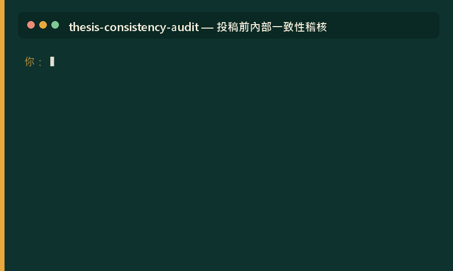

# Academic Claude Skills · 學術研究 Claude 技能包

**🌐 Language / 語言：[繁體中文](#繁體中文) · [English](#english)**

  
  
  
  

  

> 一組給**商管、財金、社會科學研究者**的 Claude Skills，量化、質化、實驗、混合方法全典範，涵蓋研究全流程。站在多位開源作者的肩膀上（見致謝）。
> A curated bundle of Claude Skills for **quantitative, qualitative & experimental research in business, finance, and social science**, covering the full research workflow. Built on the shoulders of several open-source authors (see Credits).

---
---

## 繁體中文

### 📌 這是什麼 / 給誰用
一組可掛到 Claude 上的「技能（Skills）」。掛上後，當你在對話中談到相關任務，Claude 會**自動載入對應技能**、套用該領域的專業框架，不必每次重打長提示詞。

**適合對象**：商管／財金／社會科學的量化研究者（碩、博士生與研究人員），特別是**台灣學術脈絡**（繁體中文、APA 7、口試委員意見回覆格式）的使用者。

> ⚠️ 本專案與 Anthropic **無官方關聯**。部分技能需搭配外部工具或**付費資料庫（如 TEJ）**才能發揮完整功能。

### 🆕 最新更新（v0.7.0 · 2026-07）

本版把技能包從「單一資料庫的量化工具組」擴充為**跨典範、多資料源、可重現的完整研究系統**。近期新增與強化：

- **資料策略升級：從單源到多源結合。** 新增三支資料線技能，讓付費庫（如 TEJ）與免費官方揭露能嚴謹地互補互證：
  - `public-disclosure-scout` — 免費官方公開揭露偵察（公開資訊觀測站 MOPS 重大訊息／年報／股東會／裁罰、TWSE/TPEx、政府開放資料、TIPO 專利）；是付費庫的免費姊妹線，也是公司治理／揭露**事件研究的標準事件源**。
  - `multi-source-data-integrator` — **多源結合方法論架構師**：實體解析（統編為主鍵、代號隨轉板/更名/下市變動的對接陷阱）、跨源值調解（來源優先序／容差／衝突揭露，事前訂規則不看結果挑）、來源譜系（每格資料配 `_src`/`_asof` 可回溯）、三角驗證（多源互證構念效度）、合併損耗與選擇偏誤對帳。
  - `reproducibility-architect` — **複製包架構師**：對齊 2026 頂刊資料編輯（data editor）要求，把整個研究打包成陌生人能一鍵重跑的複製包；特別處理**授權資料（如 TEJ）不可散布時的可重現困境**（程式碼公開＋存取指引＋合成資料）、資料／程式碼／AI 使用三聲明、Zenodo/OSF 的 DOI 封存。
- **方法典範全覆蓋。** 除原有量化檔案線外，補齊質化（訪談設計＋Gioia 資料結構）、問卷（CMV 攻防）、實驗（counterbalancing／情境實驗）、混合方法；`research-method-selector` 依理論成熟度為你選對方法，並含**新手小白引導模式**（連題目都沒有也給得出方向）。
- **量化前緣強化。** `causal-inference-architect`（現代交錯 DiD 的 TWFE 陷阱與 Callaway-Sant'Anna／Sun-Abraham 估計量、事件研究圖、IV/RDD/合成控制、審稿攻防表，並附方法與軟體正確引用清單）；`r-spss-syntax-architect` 增 Python(linearmodels) 與 SEM/PLS 第四軌；`text-analytics-architect` 把文字變研究變數並規範 LLM 標註信效度。
- **一條龍串接。** `research-orchestrator` 升級為全家族分診：偵察各源 → 各自清理 → 多源整合 → 因果識別／建模 → 出圖 → 投稿前對帳 → 複製包封存。

> 完整版本歷史見各 [Releases](../../releases)。技能總數：**32**。

### 🧭 運作原則（三條底線）
1. **資料由你自己抓。** 資料類技能一律假設**你（或你的機構）擁有合法訂閱／授權帳號，由你自己登入下載**。技能只教「在哪找、怎麼判斷、怎麼分析」，**不代抓資料、不散布任何資料庫的專屬目錄**。
2. **教方法，重識別假設。** 找到資料後，技能會建議**最恰當的研究設計與估計方法**（先講清楚識別假設會不會成立，再談跑哪個模型），並產出可重現的 R／SPSS／Stata 語法。
3. **資料庫中立、歡迎擴充。** 框架適用於任何資料庫（TEJ 只是內建範例）。歡迎社群依 [`docs/ADD_A_DATABASE.md`](docs/ADD_A_DATABASE.md) 新增 WRDS/Compustat、CSMAR、World Bank 等 profile。

### 🗂 技能總覽（依研究流程分組）
| 研究階段 | 技能 | 一句話功能 | 觸發詞（示例） | 授權 |
|---|---|---|---|---|
| **① 選題・文獻・資料** | `research-orchestrator` | 研究大腦總管，替你分派合適的子技能 | 不知道從何著手、綜合任務 | 原創 |
| | `research-method-selector` | 方法論適配：判量化/質化/實驗/混合＋Q1 過程套模；含新手小白引導模式 | 該用什麼方法、不知道要研究什麼 | 原創 |
| | `phd-researcher` | 文獻分析、方法論逆向、研究缺口、PRISMA、後設分析 | 文獻分析、系統性回顧、meta-analysis | 混合 🔒 |
| | `tej-data-scout` | 資料可行性偵察＋研究設計/估計方法建議（以 TEJ 為範例，資料庫中立） | 選題、資料可行性、這題能不能做 | 原創 |
| | `public-disclosure-scout` | 免費官方公開揭露偵察（MOPS 重大訊息/年報/裁罰）＋事件研究事件源整備 | 公開資訊觀測站、MOPS、免費資料、事件源 | 原創 |
| | `multi-source-data-integrator` | 多源嚴謹結合：實體解析、跨源值調解、來源譜系、三角驗證、合併損耗對帳 | 多源結合、跨源、統編對接、三角驗證 | 原創 |
| | `tej-variable-mapper` | 把 Compustat／CRSP 變數定義映射到 TEJ 對應欄位 | 變數對應、TEJ 欄位、Compustat | 原創 |
| | `tej-data-wrangler` | TEJ 原始 Excel/CSV 清理、遺漏值分析、格式標準化 | 資料清理、遺漏值、格式標準化 | 原創 |
| **② 分析・語法・量表** | `survey-research-architect` | 問卷研究全流程：設計、先驗檢定力抽樣、發放回收、CMV 攻防 | 問卷設計、樣本數、CMV | 原創 |
| | `interview-method-designer` | 深度訪談設計：三層大綱、理論抽樣與飽和、倫理知情同意 | 訪談大綱、訪幾個人、飽和 | 原創 |
| | `experiment-design-architect` | 實驗設計：組間/組內、counterbalancing、情境實驗、操弄檢核 | 實驗設計、vignette、操弄檢核 | 原創 |
| | `r-spss-syntax-architect` | 依假說生成可重現的 R／SPSS／Stata 語法（含 SEM/PLS 軌） | R 語法、SPSS 語法、PLS-SEM | 原創 |
| | `causal-inference-architect` | 因果識別策略：現代交錯 DiD、IV、RDD、合成控制、事件研究圖 | DiD、內生性、識別策略 | 原創 |
| | `text-analytics-architect` | 文字資料變研究變數：主題模型、情緒語調、LLM 標註信效度 | 文字探勘、LDA、LLM 標註 | 原創 |
| | `ob-hrm-scale-adaptor` | 量表跨文化改編（合規版）＋測量恆等性檢定語法 | 量表改編、測量恆等性、lavaan | 原創 |
| | `qualitative-thematic-coder` | Braun & Clarke 主題分析，深度訪談逐字稿編碼 | 主題分析、逐字稿編碼、質性 | 原創 |
| | `management-figure` | 出版級統計圖：倒 U 轉折點、係數森林圖、交互作用、邊際效果 | 出版級圖、forest plot、交互作用圖 | 📎 MIT |
| **③ 寫作・潤飾** | `academic-journal-polisher` | 台灣學術環境文句潤飾，杜絕 AI 慣用語 | 潤飾、去 AI 味、學術文句 | 原創 |
| | `q1-journal-polisher` | Q1–Q4 國際期刊英文潤飾＋APA 7＋模擬審查 | 期刊潤飾、投稿前、APA 7 | 原創 |
| | `nstc-grant-writer` | 國科會計畫申請書寫作：結構化撰寫＋審查人視角自評 | 國科會、NSTC、計畫書、預期成果 | 原創 |
| | `response-letter-craftsman` | 投稿修訂（R&R）逐點回覆信＋Response to Reviewers | 審查回覆、response letter、R&R、逐點回覆 | 原創 |
| **④ 投稿前品管** | `thesis-consistency-audit` | 六維度一致性稽核：假設↔迴歸表、樣本數、文字↔表格、引用 | 一致性稽核、論文對帳、投稿前檢查 | 🔒 CC BY-NC-SA |
| | `reproducibility-architect` | 複製包架構：可重現專案結構、環境鎖定、授權資料可重現困境、資料/程式碼/AI 使用聲明、DOI 封存 | 複製包、可重現、資料可用性聲明、AI 使用揭露 | 原創 |
| | `q1-journal-reviewer` | 模擬 ABS 3*/4* 匿名審查委員的批判 | 審稿、peer review、審查意見 | 原創 |
| | `citation-verifier` | 揪出 AI 捏造假文獻、孤兒引用、引用不貼合主張 | 引用查核、假文獻、孤兒引用 | 原創 |
| **⑤ 口試・簡報** | `academic-pptx` | 學術簡報內容與結構標準：行動式標題、論證式編排 | 口試簡報、conference talk | 📎 MIT |
| | `academic-slides` | Beamer 風格、零依賴單檔 HTML 學術簡報（含 KaTeX） | 學術投影片、Beamer、HTML 簡報 | 📎 MIT |
| | `academic-deck-animator` | 簡報動畫引擎：HTML+Canvas 粒子／原生 PPTX 進場動畫、逐步揭示 | PPT動畫、粒子特效、動態簡報、進場動畫 | 原創 |
| | `academic-poster` | 研討會學術海報：A0/A1、傳統三欄或 Better Poster 版式 | 海報、poster、A0、研討會海報 | 原創 |
| | `defense-qa-coach` | 口試答辯教練：委員提問題庫＋擬答框架＋模擬攻防 | 口試、答辯、模擬口試、追問 | 原創 |
| **⑥ 博士修業（模板）** | `phd-milestone-tracker` | 博士修業里程碑與 deadline 追蹤（規則為範例，請換成你系所的） | 修業里程碑、資格考期限、畢業時程 | 原創 |
| | `qual-exam-coach` | 學科資格考備考教練（可依你的考科調整） | 資格考、備考、記憶卡、模擬考 | 原創 |

**授權圖例**：原創＝作者本人著作（採根 `LICENSE`）；`📎`＝改作／收錄他人開源作品（保留原授權與姓名標示）；`🔒`＝含非商業（NC）條款。詳見 [NOTICE.md](NOTICE.md)。

> **關於引用查核**：另有優秀開源工具 [`PHY041/claude-skill-citation-checker`](https://github.com/PHY041/claude-skill-citation-checker)（比對 CrossRef／Semantic Scholar／OpenAlex）。因其上游未附授權（預設保留一切權利），本 repo **不重製其程式碼**，建議直接前往取用，與本包 `citation-verifier` 搭配。

### 🚀 安裝
**claude.ai**：Code → Download ZIP → [claude.ai](https://claude.ai) Customize → Skills → 逐一上傳你要的技能資料夾 → Settings → Capabilities 開啟 Code execution。
**Claude Code**：clone 後把 `skills/` 下要的資料夾複製到 `~/.claude/skills/`。詳見 [`docs/INSTALL.md`](docs/INSTALL.md)。

### 💡 使用範例
**範例 1 — 發想期問「這題能不能做」＋方法建議**
> **你**：我想做「董事會性別多元化對創新產出（專利數）的影響」，TEJ 做得起來嗎？
> **Claude**（`tej-data-scout`）：拆構念、給「變數 × 資料對照表」，標示董監資料【直接】、專利數【外部】（建議 TIPO）；判定為公司-年 panel，因專利為計數且過度離散 → 建議**負二項固定效果**；再交棒 `/r-spss-syntax-architect` 產語法。

**範例 2 — 投稿前一致性稽核**
> **你**：這是我的迴歸章節（.docx），投稿前幫我抓內部矛盾。
> **Claude**（`thesis-consistency-audit`）：逐一比對假設↔迴歸表、樣本數、文字↔表格數字、APA 引用，列出會被審查委員圈起來的矛盾點與修正建議。

**範例 3 — 模擬 Q1 期刊審查**
> **你**：用 ABS 3* 審查委員的角度狠一點審這篇 introduction 與 hypotheses。
> **Claude**（`q1-journal-reviewer`）：以匿名審查口吻指出理論貢獻、假設推導斷點、identification 威脅，並給 Major/Minor Revision 的具體要求。

### 📜 授權
本 repo 是**合輯（collection）**，採**逐資料夾授權**：原創技能採根 [`LICENSE`](LICENSE)；改作／收錄他人作品的技能，各資料夾內**保留原作者 LICENSE 與 `ATTRIBUTION.md`**。完整對照見 **[NOTICE.md](NOTICE.md)**。🔒 標示 Non-Commercial 的技能僅供非商業學術用途。

### 🙏 致謝
- **Zara Zhang** — `academic-slides`（MIT）
- **Yuan Yizhe（Yuan1z0825）** — `nature-skills`，`management-figure` 的出版級繪圖底子（MIT）
- **Cheng-I Wu（Imbad0202）** — `academic-research-skills`，`phd-researcher` 的系統性回顧／後設分析模組（CC BY-NC 4.0）
- **qqfly1to19** — `awesome_proofreading_auto`，`thesis-consistency-audit` 的稽核框架理念（CC BY-NC-SA 4.0）
- **PHY041** — `claude-skill-citation-checker`，推薦搭配的引用查核工具（本 repo 未重製其程式碼）
- `academic-pptx` 內容準則參考 Barbara Minto《Pyramid Principle》、Naegle (2021) *PLOS Comput Biol* 等公開學術實務。

若你是上述任一作者、對收錄或標示有任何意見，**歡迎開 issue，我會立即配合調整。**

### 🤝 貢獻 / ⚖️ 免責
歡迎 issue 與 PR，特別是新增資料庫 profile（見 [`docs/ADD_A_DATABASE.md`](docs/ADD_A_DATABASE.md)）。請先讀 [`CONTRIBUTING.md`](CONTRIBUTING.md)。本專案與 Anthropic 無官方關聯；技能輸出僅供研究輔助，**最終學術判斷與責任在使用者本人**。`phd-milestone-tracker`／`qual-exam-coach` 內的規則為**範例模板**，務必以你所屬系所公告為準。部分技能需付費資料庫（TEJ）。

---
---

## English

### 📌 What it is / Who it's for
A bundle of **Claude Skills** for the full research workflow. Once installed, Claude **auto-loads the relevant skill** when your conversation touches a matching task, applying a domain-specific framework so you don't have to re-type long prompts.

**Audience:** quantitative researchers in business, finance, and social science (master's/PhD students and faculty), especially those working in the **Taiwanese academic context** (Traditional Chinese, APA 7). Many skills are usable in any context.

> ⚠️ **Not affiliated with Anthropic.** Some skills require external tools or a **paid database (e.g., TEJ)** for full functionality.

### 🆕 What's new (v0.7.0 · 2026-07)

This release grows the bundle from a single-database quantitative toolkit into a **cross-paradigm, multi-source, reproducible research system**. Recent additions and upgrades:

- **Data strategy: from single-source to rigorous multi-source integration.** Three new data-line skills let a paid database (e.g., TEJ) and free official disclosures complement and cross-validate each other:
  - `public-disclosure-scout` — scouting of free official disclosures (Taiwan's MOPS material announcements / annual reports / shareholder meetings / sanctions, TWSE/TPEx, government open data, TIPO patents). A free counterpart to paid databases, and the **standard event source for corporate-governance / disclosure event studies**.
  - `multi-source-data-integrator` — a **multi-source integration methodology architect**: entity resolution (unified business ID as primary key; the pitfalls of tickers changing on re-listing/renaming/delisting), cross-source value reconciliation (source priority / tolerance / conflict disclosure, rules set *before* seeing results), data lineage (`_src`/`_asof` on every cell), triangulation for construct validity, and merge-loss + selection-bias accounting.
  - `reproducibility-architect` — a **replication-package architect** aligned with 2026 top-journal data editors: package a whole study so a stranger can re-run it in one command, with special treatment of the **restricted-data reproducibility problem** (licensed data like TEJ can't be redistributed → public code + access instructions + synthetic data), plus data/code/AI-use statements and Zenodo/OSF DOI archiving.
- **Full methodological-paradigm coverage.** Beyond the original archival-quant line: qualitative (interview design + Gioia data structure), survey (CMV defenses), experiment (counterbalancing / vignettes), and mixed methods. `research-method-selector` picks the right method by theoretical maturity and includes a **beginner-guidance mode** (gives direction even when you have no topic yet).
- **Frontier-quant reinforcement.** `causal-inference-architect` (modern staggered-DiD TWFE pitfalls and Callaway-Sant'Anna / Sun-Abraham estimators, event-study plots, IV/RDD/synthetic control, a reviewer-defense table, plus a correct method-and-software citation list); `r-spss-syntax-architect` adds Python (linearmodels) and a SEM/PLS lane; `text-analytics-architect` turns text into research variables with LLM-annotation validity discipline.
- **End-to-end chaining.** `research-orchestrator` now routes the whole family: scout each source → clean each → integrate → identify/model → figures → pre-submission reconciliation → replication-package archiving.

> Full version history in [Releases](../../releases). Total skills: **32**.

### 🧭 Operating principles (three ground rules)
1. **You fetch your own data.** Every data skill assumes **you (or your institution) hold a legitimate subscription/license and download the data yourself**. Skills only teach *where to look, how to judge feasibility, and how to analyze* — they never fetch data for you and never redistribute any database's proprietary catalog.
2. **Teach method, foreground identification.** After data is located, skills recommend the **appropriate research design and estimator** (is the identifying assumption plausible *first*, model choice second) and generate reproducible R/SPSS/Stata syntax.
3. **Database-agnostic and extensible.** The framework applies to any database (TEJ is just the built-in example). Contribute profiles for WRDS/Compustat, CSMAR, World Bank, etc. via [`docs/ADD_A_DATABASE.md`](docs/ADD_A_DATABASE.md).

### 🗂 Skills overview (grouped by research stage)
| Stage | Skill | What it does | License |
|---|---|---|---|
| **① Ideation・Literature・Data** | `research-orchestrator` | A router "research brain" that dispatches the right sub-skill | Original |
| | `research-method-selector` | Methodological-fit advisor (quant/qual/experiment/mixed) + Q1 process templates + beginner guidance mode | Original |
| | `phd-researcher` | Literature analysis, methodology reverse-engineering, research gaps, PRISMA systematic reviews, meta-analysis | Mixed 🔒 |
| | `tej-data-scout` | Data-feasibility scouting + research-design/estimator advice (TEJ as example; database-agnostic) | Original |
| | `public-disclosure-scout` | Free official public-disclosure scouting (MOPS filings/annual reports/sanctions) + event-study event source | Original |
| | `multi-source-data-integrator` | Rigorous multi-source integration: entity resolution, cross-source reconciliation, data lineage, triangulation, merge-loss accounting | Original |
| | `tej-variable-mapper` | Maps Compustat/CRSP variable definitions to TEJ fields | Original |
| | `tej-data-wrangler` | Cleans raw TEJ Excel/CSV: missing values, outliers, formatting | Original |
| **② Analysis・Syntax・Scales** | `survey-research-architect` | End-to-end survey research: design, a-priori power & sampling, fielding plan, CMV defenses | Original |
| | `interview-method-designer` | In-depth interview design: layered protocols, theoretical sampling & saturation, ethics | Original |
| | `experiment-design-architect` | Experimental design: between/within, counterbalancing, vignettes, manipulation checks | Original |
| | `r-spss-syntax-architect` | Generates reproducible R/SPSS/Stata syntax from hypotheses (incl. SEM/PLS lane) | Original |
| | `causal-inference-architect` | Causal identification: modern staggered DiD, IV, RDD, synthetic control, event-study plots | Original |
| | `text-analytics-architect` | Text-as-data: topic models, tone/sentiment, LLM-annotation validity discipline | Original |
| | `reproducibility-architect` | Replication packages: reproducible project structure, environment locking, restricted-data reproducibility, data/code/AI-use statements, DOI archiving | Original |
| | `ob-hrm-scale-adaptor` | Cross-cultural scale adaptation (copyright-compliant) + measurement-invariance syntax | Original |
| | `qualitative-thematic-coder` | Braun & Clarke thematic analysis for interview transcripts | Original |
| | `management-figure` | Publication-grade figures: inverted-U turning points, coefficient forest plots, interaction & marginal-effects plots | 📎 MIT |
| **③ Writing・Polishing** | `academic-journal-polisher` | Prose polishing for Taiwanese academic writing; removes AI-tells | Original |
| | `q1-journal-polisher` | Q1–Q4 journal English polishing + APA 7 + mock review | Original |
| | `nstc-grant-writer` | NSTC (Taiwan) grant-proposal writing + reviewer-lens self-assessment | Original |
| | `response-letter-craftsman` | Point-by-point R&R response letters + Response to Reviewers | Original |
| **④ Pre-submission QA** | `thesis-consistency-audit` | Six-dimension consistency audit: hypotheses↔tables, sample sizes, text↔tables, citations | 🔒 CC BY-NC-SA |
| | `q1-journal-reviewer` | Simulates an ABS 3*/4* anonymous reviewer's critique | Original |
| | `citation-verifier` | Catches AI-fabricated references, orphan citations, claim–citation mismatches | Original |
| **⑤ Defense・Slides** | `academic-pptx` | Academic slide content & structure standards: action titles, argument-driven decks | 📎 MIT |
| | `academic-slides` | Beamer-style, zero-dependency single-file HTML academic slides (KaTeX) | 📎 MIT |
| | `academic-deck-animator` | Presentation animation engine: HTML+Canvas particles / native-PPTX entrance animations | Original |
| | `academic-poster` | Conference posters: A0/A1, classic 3-column or Better-Poster layouts | Original |
| | `defense-qa-coach` | Defense Q&A coach: committee question bank + answer frameworks + mock drills | Original |
| **⑥ PhD milestones (templates)** | `phd-milestone-tracker` | PhD milestone & deadline tracker (rules are a **template** — replace with your program's) | Original |
| | `qual-exam-coach` | Qualifying-exam prep coach (adaptable to your subjects) | Original |

**Legend:** *Original* = authored by this project (root `LICENSE`); `📎` = adapted from / includes third-party open-source work (original license & attribution preserved in-folder); `🔒` = includes a Non-Commercial (NC) clause. See [NOTICE.md](NOTICE.md).

> **On citation checking:** there's an excellent open-source tool, [`PHY041/claude-skill-citation-checker`](https://github.com/PHY041/claude-skill-citation-checker) (checks CrossRef/Semantic Scholar/OpenAlex). Because its upstream ships **no license (all rights reserved)**, this repo **does not reproduce its code** — please get it from the original repo and pair it with this bundle's `citation-verifier`.

### 🚀 Install
**claude.ai:** Code → Download ZIP → [claude.ai](https://claude.ai) → Customize → Skills → upload each skill folder → Settings → Capabilities → enable Code execution.
**Claude Code:** clone, then copy the folders you want from `skills/` into `~/.claude/skills/`. See [`docs/INSTALL.md`](docs/INSTALL.md).

### 💡 Usage examples
**1 — "Is this topic feasible?" + method advice**
> **You:** I want to study board gender diversity → innovation output (patent counts). Can TEJ support this?
> **Claude** (`tej-data-scout`): decomposes the constructs, gives a variable×data table (board data = *direct*; patent counts = *external*, suggest TIPO), identifies it as a firm-year panel, and — since patents are over-dispersed counts — recommends a **negative-binomial fixed-effects** model, then hands off to `/r-spss-syntax-architect` for runnable syntax.

**2 — Pre-submission consistency audit**
> **You:** Here's my results chapter (.docx). Find internal contradictions before I submit.
> **Claude** (`thesis-consistency-audit`): cross-checks hypotheses↔tables, sample-size flow, text↔table numbers, and APA citations; lists the contradictions a reviewer would circle, with fixes.

**3 — Mock Q1 journal review**
> **You:** Review this introduction and hypotheses as a tough ABS 3* reviewer.
> **Claude** (`q1-journal-reviewer`): in an anonymous-reviewer voice, flags gaps in theoretical contribution, breaks in hypothesis logic, and identification threats, with Major/Minor-Revision-level requests.

### 📜 License
This repo is a **collection** under **per-directory licensing**: original skills follow the root [`LICENSE`](LICENSE); adapted/included third-party skills keep their own LICENSE and `ATTRIBUTION.md` in-folder. Full map in **[NOTICE.md](NOTICE.md)**. Skills marked 🔒 Non-Commercial are for non-commercial academic use only.

### 🙏 Credits
Deep thanks to the open-source authors this work stands on:
- **Zara Zhang** — `academic-slides` (MIT)
- **Yuan Yizhe (Yuan1z0825)** — `nature-skills`, the publication-grade plotting foundation of `management-figure` (MIT)
- **Cheng-I Wu (Imbad0202)** — `academic-research-skills`, the systematic-review / meta-analysis module of `phd-researcher` (CC BY-NC 4.0)
- **qqfly1to19** — `awesome_proofreading_auto`, the audit-framework concept behind `thesis-consistency-audit` (CC BY-NC-SA 4.0)
- **PHY041** — `claude-skill-citation-checker`, a recommended companion tool (its code is **not** reproduced here)
- `academic-pptx`'s content guidelines draw on Barbara Minto's *Pyramid Principle* and Naegle (2021, *PLOS Comput Biol*).

**If you are any of these authors and have any concern about inclusion or attribution, please open an issue — I will adjust immediately.**

### 🤝 Contributing / ⚖️ Disclaimer
Issues and PRs welcome — especially new database profiles ([`docs/ADD_A_DATABASE.md`](docs/ADD_A_DATABASE.md)). Please read [`CONTRIBUTING.md`](CONTRIBUTING.md). Not affiliated with Anthropic; skill outputs are research aids — **final academic judgment and responsibility rest with the user**. The `phd-milestone-tracker` / `qual-exam-coach` rules are **templates** — verify against your own institution. Some skills require a paid database (TEJ).
