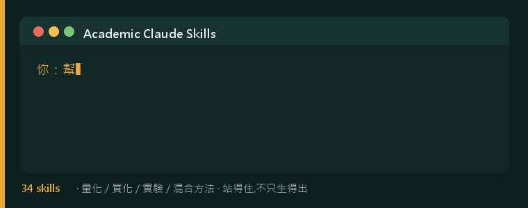

# Academic Claude Skills · 學術研究 Claude 技能包

**🌐 Language / 語言：[繁體中文](#繁體中文) · [English](#english)**

  
  
  
  

  

> 一組給**商管、財金、社會科學研究者**的 Claude Skills：從選題、找資料、**讀文獻**，到分析、寫作、投稿與複製包封存——量化／質化／實驗／混合方法全典範，涵蓋研究全流程。站在多位開源作者的肩膀上（見致謝）。
> A curated bundle of Claude Skills for **research in business, finance, and the social sciences** — from framing a question, finding data and **reading the literature**, through analysis, writing, submission, and replication-package archiving. Quantitative, qualitative, experimental, and mixed methods. Built on the shoulders of several open-source authors (see Credits).

---
---

## 繁體中文

### 📌 這是什麼 / 給誰用
一組可掛到 Claude 上的「技能（Skills）」。掛上後，當你在對話中談到相關任務，Claude 會**自動載入對應技能**、套用該領域的專業框架與紀律，不必每次重打長提示詞。

**適合對象**：商管／財金／社會科學的研究者（碩、博士生與研究人員）。原本依**台灣學術脈絡**設計（繁體中文、APA 7、口試與審查意見回覆格式），但多數技能在任何脈絡都適用。**方法典範不限量化**——質化、實驗、混合方法均有對應技能。

**這個包在意什麼**：不只把答案生出來，更在意**答案站不站得住**。數字要能指回出處、引用要能查證真偽、識別假設要先講清楚、不確定就標示不確定。技能寧可回報「查無」，也不生一個看起來合理的東西——因為看起來合理的錯誤最難被發現。

### ✨ 為什麼是這個包（而不是一堆零散提示詞）

- **腳本會真的跑，不只是給指引。** 資料與圖表類技能附**實測過的 Python／R 腳本**——你電腦裝了 Python 或 R，就能實際連線抓書目、清資料、建資料表、出圖（例：`literature-matrix-builder` 連 CrossRef 抓 DOI 直接建 Excel 比較矩陣；`r-spss-syntax-architect` 產出可貼上就跑的 R／SPSS／Stata 語法；`management-figure` 直出 300dpi 出版級圖）。
- **不只本國資料，也做跨國。** 除了台灣公開資料，`global-opendata-scout` 內建 World Bank／Eurostat／ILOSTAT／IMF／UN Data 的**免金鑰、已實測端點與撈取腳本**，並主動提醒跨國比較的陷阱（國家代碼三套不可混、幣別／PPP／基期、產業分類不可直接對應），讓你做**他國與跨國分析**不被本國資料綁死。
- **反幻覺，答案要站得住。** 數字能指回出處、引用能查真偽、CrossRef 查無就報錯不憑記憶補書目——**寧可回報查無，也不生一個看似合理的錯誤**。
- **一條龍、由「研究大腦」分派。** 從方法選擇→找資料→清理→分析→寫作→投稿→複製包封存，`research-orchestrator` 會判斷你在哪一階段、該叫哪幾支、什麼順序，不必自己記 35 支各做什麼。
- **四大方法範式齊全，還能交複製包。** 量化／質化／實驗／混合都有對應技能；`reproducibility-architect` 直接把研究打包成可重跑的複製包（環境鎖定、授權資料的可重現困境、資料／程式碼／AI 使用三聲明、DOI 封存），對接頂刊資料編輯要求。

> ⚠️ 本專案與 Anthropic **無官方關聯**。部分技能需搭配外部工具或**付費資料庫（如 TEJ）**才能發揮完整功能。

### 🆕 最新更新（v0.11.0 · 2026-08）

近期把重心放在**資料涵蓋的廣度（跨國）**、**取得的穩健度**與**文件前處理**——研究流程最前段、也最容易「髒進髒出」的幾塊。

- **v0.11.0 — 跨國／國際比較資料（`global-opendata-scout`）。** 研究要做他國或跨國比較時，內建 World Bank／Eurostat／ILOSTAT／IMF／UN Data 的**免金鑰、已實測端點與撈取腳本**，另附「如何找到任一國家官方統計機構」的五步方法論。核心價值不在找到數字，而在**主動點出跨國資料的可比性陷阱**（國家代碼三套、幣別／PPP／基期、會計年度、產業分類 ISIC／NACE／NAICS 不可直接對應、涵蓋率遺漏造成選擇偏誤）。台灣資料不涵蓋（World Bank／OECD 皆無台灣），走官方來源。
- **v0.10.0 — 複雜揭露文件前處理（`text-analytics-architect`）。** 語料若是版面複雜的揭露文件（10-K、年報、ESG 永續報告、掃描檔），`pdftotext` 直抽會把表格壓平、多欄交錯、頁尾混進正文——**髒進髒出**，污染後面的斷詞與情緒分析。新增 Step 0 指引：先用版面感知抽取轉成保留語意結構的乾淨文字（並驗抽取品質、保 source map、遮罩 PII）再分析。融合 [KingsleyOWO/Semark](https://github.com/KingsleyOWO/Semark)（Apache 2.0）的語意化文件處理概念，**只取概念不取依賴**。
- **v0.9.0 — 動態網站抓取升級階梯（`public-disclosure-scout`）。** `requests` 抓不到 JS 動態頁時的**由輕到重升級階梯**（先找背後 API → 官方批次 → 無頭瀏覽器）。融合 [unclecode/crawl4ai](https://github.com/unclecode/crawl4ai)（Apache 2.0）「把網頁轉成 LLM 可讀結構」概念，只取概念不取依賴，並**明訂 🚫 禁用其 stealth 反偵測功能**——學術研究抓不到就升級到官方管道／申請／人工，不是躲過偵測。
- **v0.8.0 — 讀文獻線（`literature-matrix-builder` + `bilingual-paper-reader`）。** 把幾十篇 PDF 變成有結構的東西:文獻比較矩陣(PDF→DOI→CrossRef 免金鑰→APA 7→20 欄 Excel,**CrossRef 查無 DOI 直接報錯不憑記憶補書目**),與單篇論文雙欄精讀(逐段中譯+五色標記+離線閱讀器)。兩支天然接力,精讀結論回填矩陣綜整欄。

一貫紀律不變:**融合外部開源都只取概念、不吞依賴、遇 copyleft 就規避、用了就在 `NOTICE.md` 與各技能 `ATTRIBUTION.md` 誠實致謝**。

> 完整版本歷史見各 [Releases](../../releases)。技能總數：**35**。
> **安裝**:整個 repo 的 ZIP 無法直接當單一技能上傳;請到 [`dist/`](dist/) 下載你要的個別 `.zip`(見下方安裝說明)。

### 🧭 運作原則（三條底線）
1. **資料由你自己抓。** 資料類技能一律假設**你（或你的機構）擁有合法訂閱／授權帳號，由你自己登入下載**。技能只教「在哪找、怎麼判斷、怎麼分析」，**不代抓資料、不散布任何資料庫的專屬目錄**。
2. **教方法，重識別假設。** 找到資料後，技能會建議**最恰當的研究設計與估計方法**（先講清楚識別假設會不會成立，再談跑哪個模型），並產出可重現的 R／SPSS／Stata 語法。
3. **資料庫中立、歡迎擴充。** 框架適用於任何資料庫（TEJ 只是內建範例）。歡迎社群依 [`docs/ADD_A_DATABASE.md`](docs/ADD_A_DATABASE.md) 新增 WRDS/Compustat、CSMAR、World Bank 等 profile。

### 🗂 技能總覽（依研究流程分組）
| 研究階段 | 技能 | 一句話功能 | 觸發詞（示例） | 授權 |
|---|---|---|---|---|
| **① 選題・文獻・資料** | `research-orchestrator` | 研究大腦總管，替你分派合適的子技能 | 不知道從何著手、綜合任務 | 原創 |
| | `research-method-selector` | 方法論適配：判量化/質化/實驗/混合＋Q1 過程套模；含新手小白引導模式 | 該用什麼方法、不知道要研究什麼 | 原創 |
| | `phd-researcher` | 文獻分析、方法論逆向、研究缺口、PRISMA、後設分析 | 文獻分析、系統性回顧、meta-analysis | 混合 🔒 |
| | `literature-matrix-builder` | 文獻語料庫與比較矩陣：PDF→DOI→CrossRef→APA 7→Excel 橫向比較表 | 文獻矩陣、文獻整理、建文獻庫、APA7、DOI 查書目 | 原創 |
| | `bilingual-paper-reader` | 單篇論文雙欄精讀：逐段中譯＋五色預先標記＋離線閱讀器（標記可持久化/匯出） | 精讀論文、論文翻譯、中英對照、畫重點做筆記 | 原創 |
| | `tej-data-scout` | 資料可行性偵察＋研究設計/估計方法建議（以 TEJ 為範例，資料庫中立） | 選題、資料可行性、這題能不能做 | 原創 |
| | `public-disclosure-scout` | 免費官方公開揭露偵察（MOPS 重大訊息/年報/裁罰）＋事件研究事件源整備 | 公開資訊觀測站、MOPS、免費資料、事件源 | 原創 |
| | `global-opendata-scout` | 跨國/國際公開統計偵察：World Bank/Eurostat/ILOSTAT/IMF/UN Data 免金鑰端點＋撈取腳本＋可比性陷阱 | 跨國、國際比較、World Bank、他國統計、cross-country | 原創 |
| | `multi-source-data-integrator` | 多源嚴謹結合：實體解析、跨源值調解、來源譜系、三角驗證、合併損耗對帳 | 多源結合、跨源、統編對接、三角驗證 | 原創 |
| | `tej-variable-mapper` | 把 Compustat／CRSP 變數定義映射到 TEJ 對應欄位 | 變數對應、TEJ 欄位、Compustat | 原創 |
| | `tej-data-wrangler` | TEJ 原始 Excel/CSV 清理、遺漏值分析、格式標準化 | 資料清理、遺漏值、格式標準化 | 原創 |
| **② 分析・語法・量表** | `survey-research-architect` | 問卷研究全流程：設計、先驗檢定力抽樣、發放回收、CMV 攻防 | 問卷設計、樣本數、CMV | 原創 |
| | `interview-method-designer` | 深度訪談設計：三層大綱、理論抽樣與飽和、倫理知情同意 | 訪談大綱、訪幾個人、飽和 | 原創 |
| | `experiment-design-architect` | 實驗設計：組間/組內、counterbalancing、情境實驗、操弄檢核 | 實驗設計、vignette、操弄檢核 | 原創 |
| | `r-spss-syntax-architect` | 依假說生成可重現的 R／SPSS／Stata 語法（含 SEM/PLS 軌） | R 語法、SPSS 語法、PLS-SEM | 原創 |
| | `causal-inference-architect` | 因果識別策略：現代交錯 DiD、IV、RDD、合成控制、事件研究圖 | DiD、內生性、識別策略 | 原創 |
| | `text-analytics-architect` | 文字資料變研究變數：主題模型、情緒語調、LLM 標註信效度 | 文字探勘、LDA、LLM 標註 | 原創 |
| | `ob-hrm-scale-adaptor` | 量表跨文化改編（合規版）＋測量恆等性檢定語法 | 量表改編、測量恆等性、lavaan | 原創 |
| | `qualitative-thematic-coder` | Braun & Clarke 主題分析，深度訪談逐字稿編碼 | 主題分析、逐字稿編碼、質性 | 原創 |
| | `management-figure` | 出版級統計圖：倒 U 轉折點、係數森林圖、交互作用、邊際效果 | 出版級圖、forest plot、交互作用圖 | 📎 MIT |
| **③ 寫作・潤飾** | `academic-journal-polisher` | 台灣學術環境文句潤飾，杜絕 AI 慣用語 | 潤飾、去 AI 味、學術文句 | 原創 |
| | `q1-journal-polisher` | Q1–Q4 國際期刊英文潤飾＋APA 7＋模擬審查 | 期刊潤飾、投稿前、APA 7 | 原創 |
| | `nstc-grant-writer` | 國科會計畫申請書寫作：結構化撰寫＋審查人視角自評 | 國科會、NSTC、計畫書、預期成果 | 原創 |
| | `response-letter-craftsman` | 投稿修訂（R&R）逐點回覆信＋Response to Reviewers | 審查回覆、response letter、R&R、逐點回覆 | 原創 |
| **④ 投稿前品管** | `thesis-consistency-audit` | 六維度一致性稽核：假設↔迴歸表、樣本數、文字↔表格、引用 | 一致性稽核、論文對帳、投稿前檢查 | 🔒 CC BY-NC-SA |
| | `reproducibility-architect` | 複製包架構：可重現專案結構、環境鎖定、授權資料可重現困境、資料/程式碼/AI 使用聲明、DOI 封存 | 複製包、可重現、資料可用性聲明、AI 使用揭露 | 原創 |
| | `q1-journal-reviewer` | 模擬 ABS 3*/4* 匿名審查委員的批判 | 審稿、peer review、審查意見 | 原創 |
| | `citation-verifier` | 揪出 AI 捏造假文獻、孤兒引用、引用不貼合主張 | 引用查核、假文獻、孤兒引用 | 原創 |
| **⑤ 口試・簡報** | `academic-pptx` | 學術簡報內容與結構標準：行動式標題、論證式編排 | 口試簡報、conference talk | 📎 MIT |
| | `academic-slides` | Beamer 風格、零依賴單檔 HTML 學術簡報（含 KaTeX） | 學術投影片、Beamer、HTML 簡報 | 📎 MIT |
| | `academic-deck-animator` | 簡報動畫引擎：HTML+Canvas 粒子／原生 PPTX 進場動畫、逐步揭示 | PPT動畫、粒子特效、動態簡報、進場動畫 | 原創 |
| | `academic-poster` | 研討會學術海報：A0/A1、傳統三欄或 Better Poster 版式 | 海報、poster、A0、研討會海報 | 原創 |
| | `defense-qa-coach` | 口試答辯教練：委員提問題庫＋擬答框架＋模擬攻防 | 口試、答辯、模擬口試、追問 | 原創 |
| **⑥ 博士修業（模板）** | `phd-milestone-tracker` | 博士修業里程碑與 deadline 追蹤（規則為範例，請換成你系所的） | 修業里程碑、資格考期限、畢業時程 | 原創 |
| | `qual-exam-coach` | 學科資格考備考教練（可依你的考科調整） | 資格考、備考、記憶卡、模擬考 | 原創 |

**授權圖例**：原創＝作者本人著作（採根 `LICENSE`）；`📎`＝改作／收錄他人開源作品（保留原授權與姓名標示）；`🔒`＝含非商業（NC）條款。詳見 [NOTICE.md](NOTICE.md)。

> **關於引用查核**：另有優秀開源工具 [`PHY041/claude-skill-citation-checker`](https://github.com/PHY041/claude-skill-citation-checker)（比對 CrossRef／Semantic Scholar／OpenAlex）。因其上游未附授權（預設保留一切權利），本 repo **不重製其程式碼**，建議直接前往取用，與本包 `citation-verifier` 搭配。

### 🚀 安裝

> ⚠️ **不能**把整個 repo 的 ZIP(Code → Download ZIP)當成一個技能上傳——那裡面有 35 個 `SKILL.md`、深層巢狀,Claude 一次只吃一個技能。也**不能只給網址**讓 claude.ai 自己抓;技能上傳是「上傳檔案」。**請用個別的 `.zip`。**

**claude.ai(逐支安裝)**
1. 到 [`dist/`](dist/) 點你要的技能 `.zip`(例 `literature-matrix-builder.zip`)→ 右側 **Download**。
2. claude.ai → 頭像 → **Settings → Capabilities**,開啟 **Code execution**(含腳本的技能需要)。
3. **Settings → Skills → Add / Upload** → 選剛下載的 `.zip` → 完成。要幾支重複幾次(平台一次一支)。上傳後跨裝置自動同步。

**Claude Code**:clone 後把 `skills/<名稱>/` 資料夾複製到 `~/.claude/skills/`(不需打包)。詳見 [`dist/README.md`](dist/README.md) 與 [`docs/INSTALL.md`](docs/INSTALL.md)。

**其他 AI 代理(Codex 等)**:技能的「內容」(SKILL.md 指引+scripts+references)是可攜的 markdown 與 Python;技能的「自動載入」機制是 Claude 專屬。在 Codex/其他代理要用,見 [`docs/USE_WITH_OTHER_AGENTS.md`](docs/USE_WITH_OTHER_AGENTS.md)。

### 💡 使用範例
**範例 1 — 發想期問「這題能不能做」＋方法建議**
> **你**：我想做「董事會性別多元化對創新產出（專利數）的影響」，TEJ 做得起來嗎？
> **Claude**（`tej-data-scout`）：拆構念、給「變數 × 資料對照表」，標示董監資料【直接】、專利數【外部】（建議 TIPO）；判定為公司-年 panel，因專利為計數且過度離散 → 建議**負二項固定效果**；再交棒 `/r-spss-syntax-architect` 產語法。

**範例 2 — 投稿前一致性稽核**
> **你**：這是我的迴歸章節（.docx），投稿前幫我抓內部矛盾。
> **Claude**（`thesis-consistency-audit`）：逐一比對假設↔迴歸表、樣本數、文字↔表格數字、APA 引用，列出會被審查委員圈起來的矛盾點與修正建議。

**範例 3 — 模擬 Q1 期刊審查**
> **你**：用 ABS 3* 審查委員的角度狠一點審這篇 introduction 與 hypotheses。
> **Claude**（`q1-journal-reviewer`）：以匿名審查口吻指出理論貢獻、假設推導斷點、identification 威脅，並給 Major/Minor Revision 的具體要求。

### 📜 授權
本 repo 是**合輯（collection）**，採**逐資料夾授權**：原創技能採根 [`LICENSE`](LICENSE)；改作／收錄他人作品的技能，各資料夾內**保留原作者 LICENSE 與 `ATTRIBUTION.md`**。完整對照見 **[NOTICE.md](NOTICE.md)**。🔒 標示 Non-Commercial 的技能僅供非商業學術用途。

### 🙏 致謝
- **Zara Zhang** — `academic-slides`（MIT）
- **Yuan Yizhe（Yuan1z0825）** — `nature-skills`，`management-figure` 的出版級繪圖底子（MIT）
- **Cheng-I Wu（Imbad0202）** — `academic-research-skills`，`phd-researcher` 的系統性回顧／後設分析模組（CC BY-NC 4.0）
- **qqfly1to19** — `awesome_proofreading_auto`，`thesis-consistency-audit` 的稽核框架理念（CC BY-NC-SA 4.0）
- **PHY041** — `claude-skill-citation-checker`，推薦搭配的引用查核工具（本 repo 未重製其程式碼）
- `academic-pptx` 內容準則參考 Barbara Minto《Pyramid Principle》、Naegle (2021) *PLOS Comput Biol* 等公開學術實務。

若你是上述任一作者、對收錄或標示有任何意見，**歡迎開 issue，我會立即配合調整。**

### 🤝 貢獻 / ⚖️ 免責
歡迎 issue 與 PR，特別是新增資料庫 profile（見 [`docs/ADD_A_DATABASE.md`](docs/ADD_A_DATABASE.md)）。請先讀 [`CONTRIBUTING.md`](CONTRIBUTING.md)。本專案與 Anthropic 無官方關聯；技能輸出僅供研究輔助，**最終學術判斷與責任在使用者本人**。`phd-milestone-tracker`／`qual-exam-coach` 內的規則為**範例模板**，務必以你所屬系所公告為準。部分技能需付費資料庫（TEJ）。

---
---

## English

### 📌 What it is / Who it's for
A bundle of **Claude Skills** covering the full research workflow. Once installed, Claude **auto-loads the relevant skill** when your conversation touches a matching task, applying that field's framework and discipline — no need to re-type long prompts.

**Audience:** researchers in business, finance, and the social sciences (master's/PhD students and faculty). Built around the **Taiwanese academic context** (Traditional Chinese, APA 7, oral-defense and reviewer-response conventions), though most skills work anywhere. **Not limited to quantitative work** — qualitative, experimental, and mixed-methods skills are included.

**What this bundle optimizes for:** not just producing an answer, but whether the answer holds up. Numbers should trace back to a source; citations should be checkable; identification assumptions get stated before models get run; uncertainty gets labelled as uncertainty. These skills would rather report "not found" than return something that merely looks plausible — because a plausible-looking error is the hardest kind to catch.

### ✨ Why this bundle (not a pile of loose prompts)

- **The scripts actually run — not just guidance.** Data and figure skills ship **tested Python/R scripts**: if your machine has Python or R, they genuinely fetch bibliographic data, clean data, build tables and render figures (e.g. `literature-matrix-builder` pulls DOIs from CrossRef straight into an Excel comparison matrix; `r-spss-syntax-architect` emits paste-and-run R/SPSS/Stata syntax; `management-figure` outputs 300 dpi publication-grade figures).
- **Not just domestic data — cross-country too.** Beyond Taiwan's public data, `global-opendata-scout` ships **key-free, tested endpoints and fetch scripts** for World Bank / Eurostat / ILOSTAT / IMF / UN Data, and proactively flags cross-country comparability traps (three country-code schemes that mustn't be mixed, currency/PPP/base-year, non-mappable industry classifications) — so **international and cross-country analysis** isn't tied to home-country data.
- **Anti-hallucination — answers that hold up.** Numbers trace back to a source; citations are checkable; a CrossRef miss fails loudly instead of filling a bibliography from memory — it would rather report "not found" than return a plausible-looking error.
- **End-to-end, dispatched by a "research brain."** From method selection → finding data → cleaning → analysis → writing → submission → replication-package archiving, `research-orchestrator` works out which stage you're in and which skills to call in what order — you don't have to memorize what all 35 do.
- **All four method paradigms, plus a replication package.** Quantitative, qualitative, experimental and mixed methods are all covered; `reproducibility-architect` packages the study into a re-runnable replication bundle (environment locking, restricted-data reproducibility, data/code/AI-use statements, DOI archiving) that meets top-journal data-editor requirements.

> ⚠️ **Not affiliated with Anthropic.** Some skills require external tools or a **paid database (e.g., TEJ)** for full functionality.

### 🆕 What's new (v0.11.0 · 2026-08)

Recent work focused on **data coverage (cross-country)**, **data-acquisition robustness**, and **document preprocessing** — the earliest stages of research, and the ones most prone to "garbage in, garbage out."

- **v0.11.0 — cross-country / international-comparison data (`global-opendata-scout`).** For studies that need other-country or cross-country comparisons, it ships **key-free, tested endpoints and fetch scripts** for World Bank / Eurostat / ILOSTAT / IMF / UN Data, plus a five-step method for locating any country's official statistics office. Its core value isn't finding numbers but **proactively flagging cross-country comparability traps** (three country-code schemes, currency/PPP/base-year, fiscal-year differences, non-mappable industry classifications ISIC/NACE/NAICS, coverage gaps causing selection bias). Taiwan isn't covered (neither World Bank nor OECD includes it) — use official domestic sources.
- **v0.10.0 — complex-disclosure preprocessing (`text-analytics-architect`).** When the corpus is layout-heavy disclosure (10-Ks, annual reports, ESG/sustainability reports, scans), naive `pdftotext` flattens tables, scrambles columns and mixes footers into the body — **garbage in, garbage out**, poisoning downstream tokenization and sentiment. A new Step 0 says: run layout-aware extraction into clean, structure-preserving text first (verify extraction quality, keep a source map, mask PII), then analyze. Adopts the concept from [KingsleyOWO/Semark](https://github.com/KingsleyOWO/Semark) (Apache 2.0) — **concept only, no dependency**.
- **v0.9.0 — dynamic-scraping escalation ladder (`public-disclosure-scout`).** When `requests` can't reach a JS-rendered page, a **lightest-to-heaviest escalation ladder** (find the underlying API first → official batch files → headless browser only if needed). Adopts the "turn web pages into LLM-readable structure" concept from [unclecode/crawl4ai](https://github.com/unclecode/crawl4ai) (Apache 2.0) — concept only, no dependency — and **explicitly forbids its stealth / anti-detection features**: scholarly scraping that can't reach a page escalates to official channels / a request / manual work, not to evading detection.
- **v0.8.0 — the literature-reading line (`literature-matrix-builder` + `bilingual-paper-reader`).** Turn dozens of PDFs into something structured: a comparison matrix (PDF→DOI→CrossRef, no key→APA 7→20-column Excel; **CrossRef miss fails loudly, never fills bibliography from memory**) and side-by-side close reading of a single paper (paragraph translation + five-colour marking + offline reader). The two hand off naturally.

The standing discipline holds: **external open source is adopted as concept only, never as a bundled dependency; copyleft is avoided; and every borrowing is credited honestly in `NOTICE.md` and each skill's `ATTRIBUTION.md`.**

> Full version history in [Releases](../../releases). Total skills: **35**.
> **Install**: the whole-repo ZIP is not a single installable skill — grab the individual `.zip` you want from [`dist/`](dist/) (see Install below).

### 🧭 Operating principles (three ground rules)
1. **You fetch your own data.** Every data skill assumes **you (or your institution) hold a legitimate subscription/license and download the data yourself**. Skills only teach *where to look, how to judge feasibility, and how to analyze* — they never fetch data for you and never redistribute any database's proprietary catalog.
2. **Teach method, foreground identification.** After data is located, skills recommend the **appropriate research design and estimator** (is the identifying assumption plausible *first*, model choice second) and generate reproducible R/SPSS/Stata syntax.
3. **Database-agnostic and extensible.** The framework applies to any database (TEJ is just the built-in example). Contribute profiles for WRDS/Compustat, CSMAR, World Bank, etc. via [`docs/ADD_A_DATABASE.md`](docs/ADD_A_DATABASE.md).

### 🗂 Skills overview (grouped by research stage)
| Stage | Skill | What it does | License |
|---|---|---|---|
| **① Ideation・Literature・Data** | `research-orchestrator` | A router "research brain" that dispatches the right sub-skill | Original |
| | `research-method-selector` | Methodological-fit advisor (quant/qual/experiment/mixed) + Q1 process templates + beginner guidance mode | Original |
| | `phd-researcher` | Literature analysis, methodology reverse-engineering, research gaps, PRISMA systematic reviews, meta-analysis | Mixed 🔒 |
| | `literature-matrix-builder` | Literature corpus + comparison matrix: PDF→DOI→CrossRef→APA 7→Excel synthesis table | Original |
| | `bilingual-paper-reader` | Side-by-side close reading of one paper: paragraph-aligned translation + five-colour pre-marking + offline reader (persistent highlights, note export) | Original |
| | `tej-data-scout` | Data-feasibility scouting + research-design/estimator advice (TEJ as example; database-agnostic) | Original |
| | `public-disclosure-scout` | Free official public-disclosure scouting (MOPS filings/annual reports/sanctions) + event-study event source | Original |
| | `global-opendata-scout` | Cross-country/international open-stats scout: key-free World Bank/Eurostat/ILOSTAT/IMF/UN Data endpoints + fetch scripts + comparability traps | Original |
| | `multi-source-data-integrator` | Rigorous multi-source integration: entity resolution, cross-source reconciliation, data lineage, triangulation, merge-loss accounting | Original |
| | `tej-variable-mapper` | Maps Compustat/CRSP variable definitions to TEJ fields | Original |
| | `tej-data-wrangler` | Cleans raw TEJ Excel/CSV: missing values, outliers, formatting | Original |
| **② Analysis・Syntax・Scales** | `survey-research-architect` | End-to-end survey research: design, a-priori power & sampling, fielding plan, CMV defenses | Original |
| | `interview-method-designer` | In-depth interview design: layered protocols, theoretical sampling & saturation, ethics | Original |
| | `experiment-design-architect` | Experimental design: between/within, counterbalancing, vignettes, manipulation checks | Original |
| | `r-spss-syntax-architect` | Generates reproducible R/SPSS/Stata syntax from hypotheses (incl. SEM/PLS lane) | Original |
| | `causal-inference-architect` | Causal identification: modern staggered DiD, IV, RDD, synthetic control, event-study plots | Original |
| | `text-analytics-architect` | Text-as-data: topic models, tone/sentiment, LLM-annotation validity discipline | Original |
| | `reproducibility-architect` | Replication packages: reproducible project structure, environment locking, restricted-data reproducibility, data/code/AI-use statements, DOI archiving | Original |
| | `ob-hrm-scale-adaptor` | Cross-cultural scale adaptation (copyright-compliant) + measurement-invariance syntax | Original |
| | `qualitative-thematic-coder` | Braun & Clarke thematic analysis for interview transcripts | Original |
| | `management-figure` | Publication-grade figures: inverted-U turning points, coefficient forest plots, interaction & marginal-effects plots | 📎 MIT |
| **③ Writing・Polishing** | `academic-journal-polisher` | Prose polishing for Taiwanese academic writing; removes AI-tells | Original |
| | `q1-journal-polisher` | Q1–Q4 journal English polishing + APA 7 + mock review | Original |
| | `nstc-grant-writer` | NSTC (Taiwan) grant-proposal writing + reviewer-lens self-assessment | Original |
| | `response-letter-craftsman` | Point-by-point R&R response letters + Response to Reviewers | Original |
| **④ Pre-submission QA** | `thesis-consistency-audit` | Six-dimension consistency audit: hypotheses↔tables, sample sizes, text↔tables, citations | 🔒 CC BY-NC-SA |
| | `q1-journal-reviewer` | Simulates an ABS 3*/4* anonymous reviewer's critique | Original |
| | `citation-verifier` | Catches AI-fabricated references, orphan citations, claim–citation mismatches | Original |
| **⑤ Defense・Slides** | `academic-pptx` | Academic slide content & structure standards: action titles, argument-driven decks | 📎 MIT |
| | `academic-slides` | Beamer-style, zero-dependency single-file HTML academic slides (KaTeX) | 📎 MIT |
| | `academic-deck-animator` | Presentation animation engine: HTML+Canvas particles / native-PPTX entrance animations | Original |
| | `academic-poster` | Conference posters: A0/A1, classic 3-column or Better-Poster layouts | Original |
| | `defense-qa-coach` | Defense Q&A coach: committee question bank + answer frameworks + mock drills | Original |
| **⑥ PhD milestones (templates)** | `phd-milestone-tracker` | PhD milestone & deadline tracker (rules are a **template** — replace with your program's) | Original |
| | `qual-exam-coach` | Qualifying-exam prep coach (adaptable to your subjects) | Original |

**Legend:** *Original* = authored by this project (root `LICENSE`); `📎` = adapted from / includes third-party open-source work (original license & attribution preserved in-folder); `🔒` = includes a Non-Commercial (NC) clause. See [NOTICE.md](NOTICE.md).

> **On citation checking:** there's an excellent open-source tool, [`PHY041/claude-skill-citation-checker`](https://github.com/PHY041/claude-skill-citation-checker) (checks CrossRef/Semantic Scholar/OpenAlex). Because its upstream ships **no license (all rights reserved)**, this repo **does not reproduce its code** — please get it from the original repo and pair it with this bundle's `citation-verifier`.

### 🚀 Install

> ⚠️ The whole-repo ZIP (Code → Download ZIP) is **not** a single installable skill — it holds 35 nested `SKILL.md` files, and Claude ingests one skill at a time. You also **can't just give claude.ai a URL**; skill upload is a file upload. **Use the individual `.zip` files.**

**claude.ai (one skill at a time)**
1. In [`dist/`](dist/), click the skill `.zip` you want (e.g. `literature-matrix-builder.zip`) → **Download** on the right.
2. claude.ai → avatar → **Settings → Capabilities**, enable **Code execution** (needed for skills with scripts).
3. **Settings → Skills → Add / Upload** → pick the downloaded `.zip` → done. Repeat per skill (the platform takes one at a time). Uploads sync across devices.

**Claude Code:** clone, then copy the `skills/<name>/` folder into `~/.claude/skills/` (no packaging needed). See [`dist/README.md`](dist/README.md) and [`docs/INSTALL.md`](docs/INSTALL.md).

**Other AI agents (Codex, etc.):** a skill's *content* (SKILL.md guidance + scripts + references) is portable Markdown and Python; the *auto-loading* mechanism is Claude-specific. To use these with Codex or another agent, see [`docs/USE_WITH_OTHER_AGENTS.md`](docs/USE_WITH_OTHER_AGENTS.md).

### 💡 Usage examples
**1 — "Is this topic feasible?" + method advice**
> **You:** I want to study board gender diversity → innovation output (patent counts). Can TEJ support this?
> **Claude** (`tej-data-scout`): decomposes the constructs, gives a variable×data table (board data = *direct*; patent counts = *external*, suggest TIPO), identifies it as a firm-year panel, and — since patents are over-dispersed counts — recommends a **negative-binomial fixed-effects** model, then hands off to `/r-spss-syntax-architect` for runnable syntax.

**2 — Pre-submission consistency audit**
> **You:** Here's my results chapter (.docx). Find internal contradictions before I submit.
> **Claude** (`thesis-consistency-audit`): cross-checks hypotheses↔tables, sample-size flow, text↔table numbers, and APA citations; lists the contradictions a reviewer would circle, with fixes.

**3 — Mock Q1 journal review**
> **You:** Review this introduction and hypotheses as a tough ABS 3* reviewer.
> **Claude** (`q1-journal-reviewer`): in an anonymous-reviewer voice, flags gaps in theoretical contribution, breaks in hypothesis logic, and identification threats, with Major/Minor-Revision-level requests.

### 📜 License
This repo is a **collection** under **per-directory licensing**: original skills follow the root [`LICENSE`](LICENSE); adapted/included third-party skills keep their own LICENSE and `ATTRIBUTION.md` in-folder. Full map in **[NOTICE.md](NOTICE.md)**. Skills marked 🔒 Non-Commercial are for non-commercial academic use only.

### 🙏 Credits
Deep thanks to the open-source authors this work stands on:
- **Zara Zhang** — `academic-slides` (MIT)
- **Yuan Yizhe (Yuan1z0825)** — `nature-skills`, the publication-grade plotting foundation of `management-figure` (MIT)
- **Cheng-I Wu (Imbad0202)** — `academic-research-skills`, the systematic-review / meta-analysis module of `phd-researcher` (CC BY-NC 4.0)
- **qqfly1to19** — `awesome_proofreading_auto`, the audit-framework concept behind `thesis-consistency-audit` (CC BY-NC-SA 4.0)
- **PHY041** — `claude-skill-citation-checker`, a recommended companion tool (its code is **not** reproduced here)
- `academic-pptx`'s content guidelines draw on Barbara Minto's *Pyramid Principle* and Naegle (2021, *PLOS Comput Biol*).

**If you are any of these authors and have any concern about inclusion or attribution, please open an issue — I will adjust immediately.**

### 🤝 Contributing / ⚖️ Disclaimer
Issues and PRs welcome — especially new database profiles ([`docs/ADD_A_DATABASE.md`](docs/ADD_A_DATABASE.md)). Please read [`CONTRIBUTING.md`](CONTRIBUTING.md). Not affiliated with Anthropic; skill outputs are research aids — **final academic judgment and responsibility rest with the user**. The `phd-milestone-tracker` / `qual-exam-coach` rules are **templates** — verify against your own institution. Some skills require a paid database (TEJ).
